# Network Intelligence Pipeline Diagram

```mermaid
graph LR
    subgraph "Network Intelligence Pipeline"
        A[🔄 Development<br/>network-intelligence-dev<br/>https://network-intelligence-dev-0581f075e6f6.herokuapp.com/] 
        B[🧪 Staging<br/>network-intelligence-stage<br/>https://network-intelligence-stage-1ae64afe4812.herokuapp.com/] 
        C[🚀 Production<br/>network-intelligence-prod<br/>https://network-intelligence-prod-09c19480041d.herokuapp.com/]
        
        A -->|Promote| B
        B -->|Promote| C
    end
    
    subgraph "Infrastructure"
        D[🗄️ PostgreSQL<br/>Standard-0]
        E[⚡ Redis<br/>Premium-1]
        F[📊 Papertrail<br/>Logging]
        G[🤖 AI Inference<br/>Claude + Cohere]
    end
    
    A -.-> D
    A -.-> E
    A -.-> F
    B -.-> D
    B -.-> E
    B -.-> F
    C -.-> D
    C -.-> E
    C -.-> F
    C -.-> G
```



## Pipeline Details

| Stage | App Name | URL | Dynos | Add-ons |
|-------|----------|-----|-------|---------|
| **Development** | `network-intelligence-dev` | [Dev App](https://network-intelligence-dev-0581f075e6f6.herokuapp.com/) | 1x Standard-2X | PostgreSQL, Redis, Papertrail |
| **Staging** | `network-intelligence-stage` | [Stage App](https://network-intelligence-stage-1ae64afe4812.herokuapp.com/) | 1x Standard-2X | PostgreSQL, Redis, Papertrail |
| **Production** | `network-intelligence-prod` | [Prod App](https://network-intelligence-prod-09c19480041d.herokuapp.com/) | 1x Standard-2X | PostgreSQL, Redis, Papertrail, AI Inference |

## Deployment Commands

```bash
# Promote from Development to Staging
heroku pipelines:promote --app network-intelligence-dev --to network-intelligence-stage

# Promote from Staging to Production  
heroku pipelines:promote --app network-intelligence-stage --to network-intelligence-prod

# View pipeline status
heroku pipelines:info network-intelligence
```

## Team Information
- **Pipeline Owner**: `heroku-se-demo` (team)
- **Region**: US
- **Stack**: heroku-24
- **Created**: July 22, 2025 